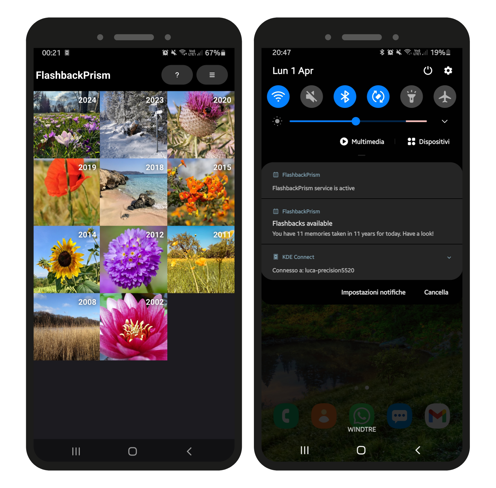

# FlashbackPrism

This is a small client for [PhotoPrism](https://github.com/photoprism/photoprism) written in Qt. Its only purpose is to show the photos taken years ago in the same date as today. This is an interesting way to review the photos from your collection. PhotoPrism seems to lack this feature in a way that is comfortable for me, so I took some time to implement it, waiting for an official implementation.

The application includes a GUI to browse the photos in previous years, open them and share. It also includes code monitoring the PhotoPrism server for changes and sending a notification approximately at 8am if new photos are available. In Linux, the notification only arrives when the app is running. In Android, the application includes a service, so it should work even after the application is closed.

  
  

## Supported Systems

I wrote the application just for me, so I built it for Linux and Android only. It is written with the Qt framework, but a few platform specific portions may need to be added.

* **Linux**: everything works, but notifications arrive only when the app is running;
* **Android**: everything should work;
* **Windows**: untested but should work. Notifications arrive only when the app is running.
* **MacOS**: untested but should work. Notifications arrive only when the app is running.
* **iOS**: untested but should work. Notifications arrive only when the app is running.

## Installation

Only Android arm64 binaries are provided for download [here](https://bugfreeblog.duckdns.org/2024/01/revisit-todays-photos-from-n-years-ago-with-photoprism.html).

You'll have to build from the sources for the other platforms.

## Defects

The tool is built around my need and is **not tested**, so I expect many bugs to be present. This is a partial list of things that should be improved:

- [ ] AppImage is missing
- [ ] Replace the Android service with AlarmManager to save battery
- [ ] Create a settings page and let the user tune the parameters
- [ ] Improve the UI a bit
- [x] Improve the orientation detection
- [x] Handle videos
- [ ] Handle heic format (Qt has a patch for this, so probably waiting is sufficient)
- [x] HTTPS is untested. It may work, but I never tested it in any way.

[...]
